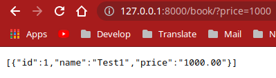
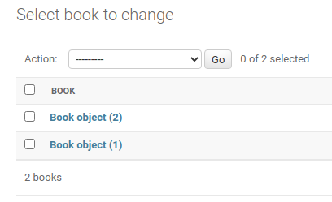
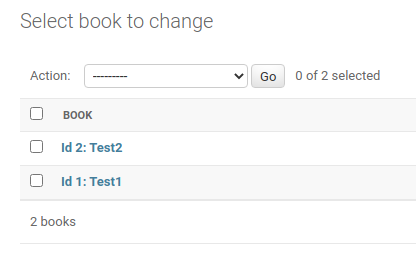
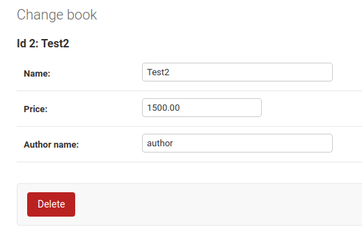
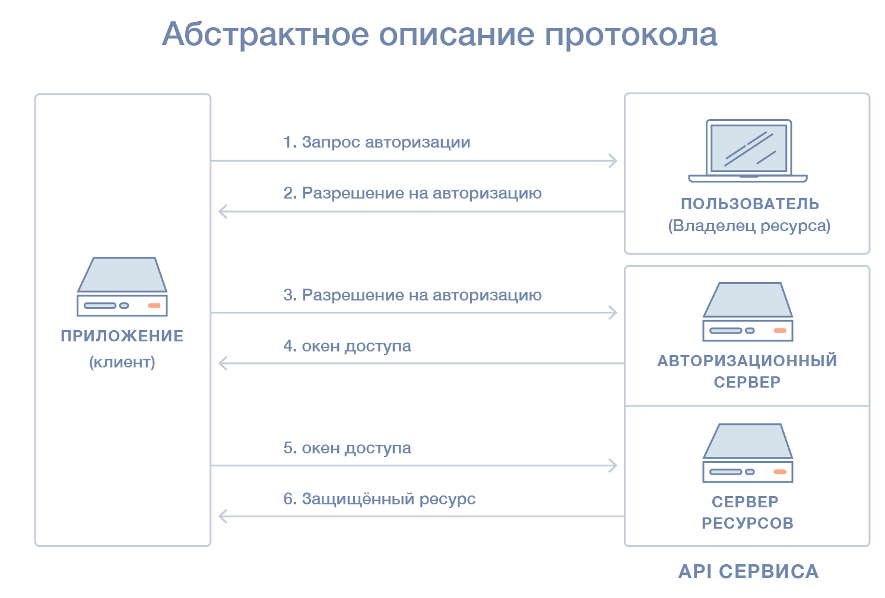

# Конспект по Django
## 1. Начало проекта

Первым делом нужно настроить соединение с базами данных

```python
DATABASES = {
    'default': {
        'ENGINE': 'django.db.backends.postgresql_psycopg2',
        'NAME': 'books_db',
        'USER': 'books_user',
        'PASSWORD': 'books_user',
        'HOST': 'localhost',
        'PORT': '',
    }
}
```
Далее создайте модели в `models.py`
```python
from django.db import models


class Book(models.Model):
    name = models.CharField(max_length=255)
    price = models.DecimalField(max_digits=7,decimal_places=2)
  
```
Добавьте ваше приложение в ```INSTALLED_APPS``` в ```settings.py```
```python
INSTALLED_APPS = [
    'django.contrib.admin',
    'django.contrib.auth',
    'django.contrib.contenttypes',
    'django.contrib.sessions',
    'django.contrib.messages',
    'django.contrib.staticfiles',

    'store',
]
```
Создаём миграции
```bash
python3 manage.py makemigrations
```
Мигрируем
```bash
python3 manage.py migrate
```
Установите djangorestframework
```bash
pip install djangorestframework
```
Теперь создайте `serializers.py`
```python
from rest_framework.serializers import ModelSerializer

from store.models import Book


class BooksSerializer(ModelSerializer):
    class Meta:
        model = Book
        fields = "__all__"

```
Создайте вид в `views.py`
```python
from rest_framework.viewsets import ModelViewSet

from store.models import Book
from store.serializers import BooksSerializer


class BookViewSet(ModelViewSet):
    queryset = Book.objects.all()
    serializer_class = BooksSerializer
```
Зарегистрируйте новый роутер в `urls.py`
```python
from django.contrib import admin
from django.urls import path
from rest_framework.routers import SimpleRouter

from store.views import BookViewSet

router = SimpleRouter()
router.register(r'book', BookViewSet)

urlpatterns = [
    path('admin/', admin.site.urls),
]

urlpatterns += router.urls
```

## 2. Unit tests
Удалите `tests.py` в вашем приложении и создайте пакет ```tests```.
Для примера создадим файл `logic.py` в вашем приложении.
Также создайте `test_logic.py` в `<your_app>/tests/`.
Если возникают ошибки, настройте ваш тестовый интерпретатор следующим образом


`logic.py`
```python
def operations(a, b, c):
    if b == '+':
        return a + c
    if b == '-':
        return a - c
    if b == '*':
        return a * c
    if b == '/':
        return a / c

```
`test_logic.py`
```python
from django.test import TestCase

from store.logic import operations


class LogicTestCase(TestCase):
    def test_plus(self):
        result = operations(6, '+', 13)
        self.assertEqual(19, result)

    def test_minus(self):
        result = operations(6, '-', 13)
        self.assertEqual(-7, result)

    def test_multiply(self):
        result = operations(6, '*', 13)
        self.assertEqual(78, result)

```
Получаем:


Для возможности подключиться к СУБД от созданного пользователя, необходимо проверить настройки прав в конфигурационном файле pg_hba.conf.

Для начала смотрим путь расположения данных для PostgreSQL:

```=# SHOW config_file;```

В ответ мы получим, что-то на подобие:

```----------------------------------------- 
/var/lib/pgsql/13/data/postgresql.conf
(1 row)
```

* в данном примере /var/lib/pgsql/13/data/ — путь расположения конфигурационных файлов.

Открываем ```pg_hba.conf```:

```bash
sudo nano /var/lib/pgsql/9.6/data/pg_hba.conf
```

Добавляем права на подключение нашему созданному пользователю:


```
# IPv4 local connections:
host    all             dmosk           127.0.0.1/32            md5
```

* в данном примере мы разрешили подключаться пользователю dmosk ко всем базам на сервере (all) от узла 127.0.0.1 (localhost) с требованием пароля (md5).
* необходимо, чтобы данная строка была выше строки, которая прописана по умолчанию
host    all             all             127.0.0.1/32            ident.

После перезапускаем службу:

```bash
systemctl restart postgresql
```
Запускаем тесты
```bash
./manage.py test .
```
И видим, что тесты выполнены успешно
```
Creating test database for alias 'default'...
System check identified no issues (0 silenced).
...
----------------------------------------------------------------------
Ran 3 tests in 0.008s

OK
Destroying test database for alias 'default'...
```
Создадим файл `test_api.py` с тестами для нашего проекта.
```python
from django.urls import reverse
from rest_framework import status

from store.models import Book
from rest_framework.test import APITestCase

from store.serializers import BooksSerializer


class BooksApiTestCase(APITestCase):
    def test_get(self):
        book_1 = Book.objects.create(name='Test book 1', price=25)
        book_2 = Book.objects.create(name='Test book 2', price=140)
        url = reverse('book-list')
        response = self.client.get(url)
        serializer_data = BooksSerializer([book_1, book_2], many=True).data
        self.assertEqual(status.HTTP_200_OK, response.status_code)
        self.assertEqual(serializer_data, response.data)

```
Если что-то поменяется в сериализаторе, то тест будет работать.
По сути мы сравниваем его с самим собой.
Создадим тест конкретно для сериализатора в `test_serializers.py`
```python
from django.test import TestCase

from store.models import Book
from store.serializers import BooksSerializer


class BooksSerializerTestCase(TestCase):
    def test_ok(self):
        book_1 = Book.objects.create(name='Test book 1', price=25)
        book_2 = Book.objects.create(name='Test book 2', price=140)
        data = BooksSerializer([book_1, book_2], many=True).data
        expected_data = [
            {
                'id': book_1.id,
                'name': 'Test book 1',
                'price': '25.00'
            },
            {
                'id': book_2.id,
                'name': 'Test book 2',
                'price': '140.00'
            },
        ]
        self.assertEqual(expected_data, data)
```
Очевидно, что многое повторяется и нужно что-то оптимизировать.
Но это не обязательно! Тесты должны быть простыми и копипаста тут помогает.
Установим `coverage` в виртуальное окружение.

Выполним
```bash
coverage run --source='.' ./manage.py test . 
```
Как видим, все тесты выполнены успешно.
Все 5 точек
```bash
Creating test database for alias 'default'...
System check identified no issues (0 silenced).
.....
----------------------------------------------------------------------
Ran 5 tests in 0.103s

OK
Destroying test database for alias 'default'...
```
Посмотрим детальную информацию по покрытию тестами наших фалов
```bash
coverage report
```
```bash
Name                               Stmts   Miss  Cover
------------------------------------------------------
books/__init__.py                      0      0   100%
books/asgi.py                          4      4     0%
books/settings.py                     19      0   100%
books/urls.py                          8      0   100%
books/wsgi.py                          4      4     0%
manage.py                             12      2    83%
store/__init__.py                      0      0   100%
store/admin.py                         1      0   100%
store/apps.py                          4      0   100%
store/logic.py                         9      2    78%
store/migrations/0001_initial.py       5      0   100%
store/migrations/__init__.py           0      0   100%
store/models.py                        4      0   100%
store/serializers.py                   6      0   100%
store/tests/__init__.py                0      0   100%
store/tests/test_api.py               14      0   100%
store/tests/test_logic.py             12      0   100%
store/tests/test_serializers.py       10      0   100%
store/views.py                         6      0   100%
------------------------------------------------------
TOTAL                                118     12    90%
```
Мы можем получить визуальный отчёт
```bash
coverage html
```
Создалась папка `htmlcov` в которой нужно открыть в браузере `index.html`


Посмотрим детально тест на `logic.py`


* Зелёные линии - участок кода куда заходил тест
* Красные линии - не протестированный участок когда


### 3. Filters, Search and Ordering

Установим `django-filter`. Теперь мы можем настраивать фильтры во `views.py`.
Допишем в `BookViewSet` следующие строки
```python
    filter_backends = [DjangoFilterBackend]
    filter_fields = ['price']
```
Далее для стандартного отображения данных в `json` формате, определим его в `settings.py`
```python
REST_FRAMEWORK = {
    'DEFAULT_RENDERER_CLASSES': [
        'rest_framework.renderers.JSONRenderer',
        # 'rest_framework.renderers.BrowsableAPIRenderer',
    ],
    'DEFAULT_PARSER_CLASSES': [
        'rest_framework.parsers.JSONParser',
    ]
}
```
Запускаем сервер и проверяем фильтр по цене



Как видим всё работает!
Но надоедает добавлять книги через `shell` Django.
Сделаем всё интерактивно в `admin.py`
```python
from django.contrib import admin
from django.contrib.admin import ModelAdmin

from store.models import Book


@admin.register(Book)
class BookAdmin(ModelAdmin):
    pass
```
Заходим в админку, Books и видим



Сделаем более человечный вывод книг в `models.py`
```python
from django.db import models


class Book(models.Model):
    name = models.CharField(max_length=255)
    price = models.DecimalField(max_digits=7, decimal_places=2)

    def __str__(self):
        return f'Id {self.id}: {self.name}'

```
Обновим страницу



Теперь лучше!
Теперь настроим поиск. Для этого снова изменим `models.py` добавив имя автора в модель книги
```python
author_name = models.CharField(max_length=255)
```
Теперь книги имеют следующие поля



Далее настраиваем поиск. Изменим `filter_backends` в `views.py`
```python
filter_backends = [DjangoFilterBackend, SearchFilter]
```
Также добавим поля, по которым будет происходить поиск. Желательно от двух полей, поскольку иначе это фильтр
```python
search_fields = ['name', 'author_name']
```
По запросу в браузере `http://127.0.0.1:8000/book/?search=Leo`
получим найденные книги
```json
[
  {"id":4,"name":"War and Peace","price":"20000.00","author_name":"Leo Tolstoy"},
  {"id":5,"name":"Anna Karenina","price":"19000.00","author_name":"Leo Tolstoy"},
  {"id":6,"name":"Life of Leo Tolstoy","price":"1300.00","author_name":"Joe Biden"}
]
```
Добавим сортировку
```python
from rest_framework.filters import SearchFilter, OrderingFilter
...
...
filter_backends = [DjangoFilterBackend, SearchFilter, OrderingFilter]
ordering_fields = ['price', 'author_name']
```
Теперь по запросу `http://127.0.0.1:8000/book/?ordering=price`
мы увидим отсортированные книги
```json
[
  {
    "id": 2,
    "name": "Perfume",
    "price": "500.00",
    "author_name": "Petrick Suskind"
  },
  {
    "id": 1,
    "name": "The Collector",
    "price": "1000.00",
    "author_name": "John Fowles"
  },
  {
    "id": 3,
    "name": "In Search of Lost Time",
    "price": "1200.00",
    "author_name": "Marcel Proust"
  },
  {
    "id": 6,
    "name": "Life of Leo Tolstoy",
    "price": "1300.00",
    "author_name": "Joe Biden"
  },
  {
    "id": 5,
    "name": "Anna Karenina",
    "price": "19000.00",
    "author_name": "Leo Tolstoy"
  },
  {
    "id": 4,
    "name": "War and Peace",
    "price": "20000.00",
    "author_name": "Leo Tolstoy"
  }
]
```
Код отформатирован, для лучшей наглядности!
По запросу `http://127.0.0.1:8000/book/?ordering=-price` сортировка будет по убыванию
```json
[
  {
    "id": 4,
    "name": "War and Peace",
    "price": "20000.00",
    "author_name": "Leo Tolstoy"
  },
  {
    "id": 5,
    "name": "Anna Karenina",
    "price": "19000.00",
    "author_name": "Leo Tolstoy"
  },
  {
    "id": 6,
    "name": "Life of Leo Tolstoy",
    "price": "1300.00",
    "author_name": "Joe Biden"
  },
  {
    "id": 3,
    "name": "In Search of Lost Time",
    "price": "1200.00",
    "author_name": "Marcel Proust"
  },
  {
    "id": 1,
    "name": "The Collector",
    "price": "1000.00",
    "author_name": "John Fowles"
  },
  {
    "id": 2,
    "name": "Perfume",
    "price": "500.00",
    "author_name": "Petrick Suskind"
  }
]
```
Теперь напишем тесты для фильтрации и поиска.
Также немного улучшим код, исключив повторения
```python
class BooksApiTestCase(APITestCase):
    def setUp(self):
        self.book_1 = Book.objects.create(name='Test book 1', price=25, author_name='Author 1')
        self.book_2 = Book.objects.create(name='Test book 2', price=55, author_name='Author 5')
        self.book_3 = Book.objects.create(name='Test book Author 1', price=55, author_name='Author 2')

    def test_get(self):
        url = reverse('book-list')
        response = self.client.get(url)
        serializer_data = BooksSerializer([self.book_1, self.book_2, self.book_3], many=True).data
        self.assertEqual(status.HTTP_200_OK, response.status_code)
        self.assertEqual(serializer_data, response.data)

    def test_get_filter(self):
        url = reverse('book-list')
        response = self.client.get(url, data={'price': 55})
        serializer_data = BooksSerializer([self.book_2, self.book_3], many=True).data
        self.assertEqual(status.HTTP_200_OK, response.status_code)
        self.assertEqual(serializer_data, response.data)

    def test_get_search(self):
        url = reverse('book-list')
        response = self.client.get(url, data={'search': 'Author 1'})
        serializer_data = BooksSerializer([self.book_1, self.book_3], many=True).data
        self.assertEqual(status.HTTP_200_OK, response.status_code)
        self.assertEqual(serializer_data, response.data)

    def test_get_ordering(self):
        url = reverse('book-list')
        response = self.client.get(url, data={'ordering': 'price'})
        serializer_data = BooksSerializer([self.book_1, self.book_2, self.book_3], many=True).data
        self.assertEqual(status.HTTP_200_OK, response.status_code)
        self.assertEqual(serializer_data, response.data)
```
В функции `setUp` выполняются действия перед каждым тестом.

### 4. OAuth

Добавим в `BookViewSet`
```python
permission_classes = [IsAuthenticated]
```
Теперь когда мы обратимся к нашей странице, будет выдано следующее сообщение
```json
{"detail": "Authentication credentials were not provided."}
```
Если этого не выдало, а вы получили тот же результат, что и раньше, то вам нужно выйти из уже авторизованного пользователя.
Вероятнее всего это был `admin`.

Установим пакет `social-auth-app-django`. Добавим приложение `social_django` в `INSTALLED_APPS`
```python
INSTALLED_APPS = [
    'django.contrib.admin',
    'django.contrib.auth',
    'django.contrib.contenttypes',
    'django.contrib.sessions',
    'django.contrib.messages',
    'django.contrib.staticfiles',

    'social_django',

    'store',
]
```
Рекомендуется сохранять последовательность:
* Приложения джанго
* Другие установленные приложения
* Приложения, которые написали сами

Выполним
```bash
./manage.py migrate
```
Теперь разрешим аутентификатору пользоваться `json` полями в постгресе.
Для этого нужно добавить настройку в `settings.py`
```python
SOCIAL_AUTH_POSTGRES_JSONFIELD = True
```
Также добавим
```python
AUTHENTICATION_BACKENDS = (
    'social_core.backends.github.GithubOAuth2',
    'django.contrib.auth.backends.ModelBackend',
)
SOCIAL_AUTH_GITHUB_KEY = 'a1b2c3d4'
SOCIAL_AUTH_GITHUB_SECRET = 'e5f6g7h8i9'
```
Изменим `urlpatterns` и импортируем всё из `django.conf` и `django.urls`
```python
urlpatterns = [
    path('admin/', admin.site.urls),
    url('', include('social_django.urls', namespace='social'))
]
```
Для кастомизации пространства имён (namespace) можно добавить настройку
```python
SOCIAL_AUTH_URL_NAMESPACE = 'social'
```
Она нужна для работы `reverse` на наших урлах.

Кратко что будет происходить, как работает аутентификация.
Запустив сервер мы увидим следующую ошибку
```
Using the URLconf defined in books.urls, Django tried these URL patterns, in this order:
    1. admin/
    2. login/<str:backend>/ [name='begin']
    3. complete/<str:backend>/ [name='complete']
    4. disconnect/<str:backend>/ [name='disconnect']
    5. disconnect/<str:backend>/<int:association_id>/ [name='disconnect_individual']
    6. ^book/$ [name='book-list']
    7. ^book/(?P<pk>[^/.]+)/$ [name='book-detail']
```
Пользователя будет перебрасывать на `GitHub`, где он будет вводить свои данные.
Если он авторизован, то ему будет достаточно нажать, что он согласен, что его будет авторизовывать данное приложение через `GitHub`.
`GitHub` в свою очередь посылает нам ответ, что пользователь авторизован.

Как работает OAuth



